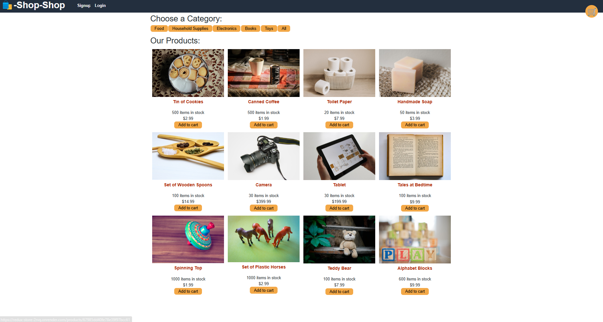
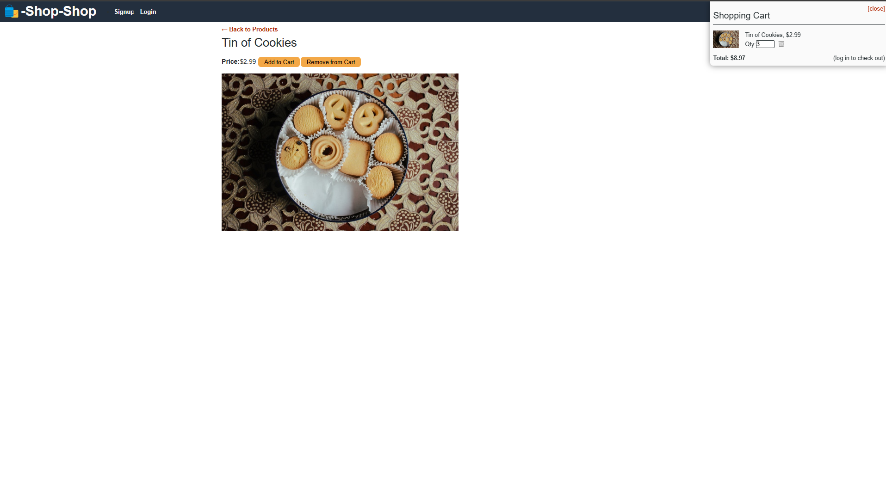

# [ReduxRefactor](https://redux-store-2rvq.onrender.com/)
Full-stack e-commerce platform refactored from React API to Redux.

## Usage
**Features**
- User authentication
- Product search
- Edit items in cart
- Add and remove products from cart
- Stripe checkout (Use [test cards](https://www.paypalobjects.com/en_GB/vhelp/paypalmanager_help/credit_card_numbers.htm) for test transaction.)
- Order history

**User Story:**
```md
AS a senior engineer working on an e-commerce platform
I WANT my platform to use Redux to manage global state instead of the Context API
SO THAT my website's state management is taken out of the React ecosystem
```

**Acceptance Criteria:**
```md
GIVEN an e-commerce platform that uses Redux to manage global state
WHEN I review the app’s store
THEN I find that the app uses a Redux store instead of the Context API
WHEN I review the way the React front end accesses the store
THEN I find that the app uses a Redux provider
WHEN I review the way the app determines changes to its global state
THEN I find that the app passes reducers to a Redux store instead of using the Context API
WHEN I review the way the app extracts state data from the store
THEN I find that the app uses Redux instead of the Context API
WHEN I review the way the app dispatches actions
THEN I find that the app uses Redux instead of the Context API
```

## Installation
This application is deployed using [Render](https://redux-store-2rvq.onrender.com/).

## Demonstration
   <div style="margin-left: 40px;">
   Image of the application's storefront page:<br/>
   
   </div>
   <br/>

   <div style="margin-left: 40px;">
   Image of the application's purchase page:<br/>
   
   </div>
   <br/>

## Walk Through
Link to live site: 
click here &rarr; 
[https://ecommerce-redux-n2lz.onrender.com/]([https://google-books-efki.onrender.com/](https://ecommerce-redux-n2lz.onrender.com/))

## Technologies Employed
**Frontend:**  
    
    

**Backend:**  
    
      
    

**Authentication:**  
   


## Future Development
I do not plan to make any further developments on this project outside of using it as a learning and resource model.

## Contributing
Contributions are welcome and encouraged. To do so:
- Fork this repository.  
- Your pull request will need approval in order to merge to `main`.  
- Take a look at the [Future Development](#future-development) section to see what I am currently working on.

## Credits
This code was written as an exercise by the edX coding bootcamp and modified to function by me.

## Tests
No tests are needed beyond visiting the website.

## Questions
If you have any questions, please reach out to me at:
- Email: [tyanne.codes@gmail.com](mailto:tyanne.codes@gmail.com)
- GitHub: [tyannejensen](https://github.com/tyannejensen)
